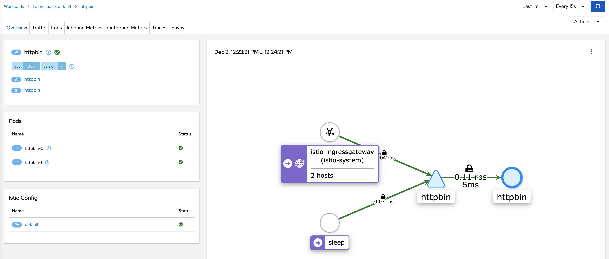

# Istio HTTPS Ingress for StatefulSets

### Table of Contents

- [Introduction](#introduction)
- [Prerequisites](#prerequisites)
- [Setup](#setup)
- [Test](#test)
- [Cleanup](#cleanup)
- [Troubleshooting](#troubleshooting)

---

## Introduction

A StatefulSet is a Kubernetes resource for managing a stateful application that provide guarantees about the ordering
and uniqueness of pods. In many instances, clients must connect to specific Pods of a StatefulSet. This document
provides instructions for securely exposing individual StatefulSet pods through an Istio ingress gateway.

## Prerequisites

- [Kind][1] or a Kubernetes cluster. If using your own cluster, the Kubernetes version must be [supported][2] by
Istio 1.12.
- [istioctl 1.12][3]
- [OpenSSL][4] for generating secure Ingress TLS assets.
## Setup

### Kubernetes Cluster

Run the provided script to create a 1.21.1 Kubernetes cluster using Kind.
```
./hack/kind-istio-cluster.sh
```
The script exposes Istio ingress gateway's HTTP/HTTPS ports as host ports 80/443. These ports must be available on your
Kind host or modify the script.

### Istio
Install Istio 1.12:
```
istioctl install -f ./manifests/istio-operator-nodeport.yaml -y --verify
```

Setup the default namespace for automatic sidecar injection:
```
kubectl label ns/default istio-injection=enabled
```

### TLS Assets

Generate TLS assets used by the Istio ingress gateway.

For macOS users, verify curl is compiled with the LibreSSL library:
```
curl --version | grep LibreSSL
curl 7.54.0 (x86_64-apple-darwin17.0) libcurl/7.54.0 LibreSSL/2.0.20 zlib/1.2.11 nghttp2/1.24.0
```

Create the root key/cert:
```
openssl req -x509 -sha256 -nodes -days 365 -newkey rsa:2048 -subj '/O=example Inc./CN=example.com' -keyout example.com.key -out example.com.crt
```

Create cert/key for httpbin services:
```
openssl req -out httpbin-0.example.com.csr -newkey rsa:2048 -nodes -keyout httpbin-0.example.com.key -subj "/CN=httpbin-0.example.com/O=httpbin organization"
openssl x509 -req -days 365 -CA example.com.crt -CAkey example.com.key -set_serial 0 -in httpbin-0.example.com.csr -out httpbin-0.example.com.crt
openssl req -out httpbin-1.example.com.csr -newkey rsa:2048 -nodes -keyout httpbin-1.example.com.key -subj "/CN=httpbin-1.example.com/O=httpbin organization"
openssl x509 -req -days 365 -CA example.com.crt -CAkey example.com.key -set_serial 0 -in httpbin-1.example.com.csr -out httpbin-1.example.com.crt
```

Store the certs/keys in secrets:
```
kubectl create -n istio-system secret tls httpbin-0-credential --key=httpbin-0.example.com.key --cert=httpbin-0.example.com.crt
kubectl create -n istio-system secret tls httpbin-1-credential --key=httpbin-1.example.com.key --cert=httpbin-1.example.com.crt
```

Create the httpbin app and required Istio resources:
```
kubectl apply -f ./manifests/statefulset-ingress.yaml
```
__Note:__ Httpbin uses a [Headless Service][5] with a selector. This causes the endpoints controller to create
`Endpoints` records in the API, and modifies the DNS configuration to return A records (IP addresses) that point
directly to the `Pods` backing the httpbin `Service`.

## Test

Install the Prometheus and Kiali addons to visualize the connections.
```
kubectl apply -f https://raw.githubusercontent.com/istio/istio/release-1.12/samples/addons/prometheus.yaml
kubectl apply -f https://raw.githubusercontent.com/istio/istio/release-1.12/samples/addons/kiali.yaml
```

Open the Kiali dashboard in a separate terminal window.
```
istioctl dashboard kiali
```

Run the sleep app as a client to verify internal mesh connectivity.
```
kubectl apply -f https://raw.githubusercontent.com/istio/istio/release-1.12/samples/sleep/sleep.yaml
```

Test internal mesh connectivity from the sleep client:
```
kubectl exec -it deploy/sleep -c sleep -- curl -I http://httpbin-0.httpbin.default.svc.cluster.local/status/200
```
You should receive a `200` HTTP response code. Repeat this step for the `httpbin-1` Pod.

Test external mesh connectivity:
```
curl -I --cacert example.com.crt -HHost:httpbin-0.example.com --resolve "httpbin-0.example.com:443:127.0.0.1" "https://httpbin-0.example.com/status/200"
```
You should receive a `200` HTTP response code. Repeat this step for the `httpbin-1` Pod.

Navigate to the Kiali Workloads pane. Make sure "default" and "istio-system" namespaces are selected.
The padlock icons on the traffic flows indicate that the connections are secure.
__Note:__ You may need to regenerate traffic if the graph is empty.



## Cleanup

Delete the cluster:
```
kind delete cluster --name istio
```

## Troubleshooting

Confirm the httpbin `Endpoints`:
```
kubectl get endpoints/httpbin -o yaml
```
Two `Endpoints` should exist with hostname `httpbin-0` and `httpbin-1` respectivly.

[1]: https://kind.sigs.k8s.io/
[2]: https://istio.io/latest/docs/releases/supported-releases/#support-status-of-istio-releases
[3]: https://istio.io/latest/docs/setup/getting-started/#download
[4]: https://www.openssl.org/
[5]: https://gist.githubusercontent.com/danehans/8592d18ab03b08b2973dfa81acf9a0cd/raw/49058fa9ac29efc2c1273fed4a4140264a84e72b/kind-istio-cluster.sh
[6]: https://gist.githubusercontent.com/danehans/8592d18ab03b08b2973dfa81acf9a0cd/raw/ed9b1a00627817b27483e5951bd34e8261edc2a6/istio_operator.yaml
[7]: https://kubernetes.io/docs/concepts/services-networking/service/#headless-services
